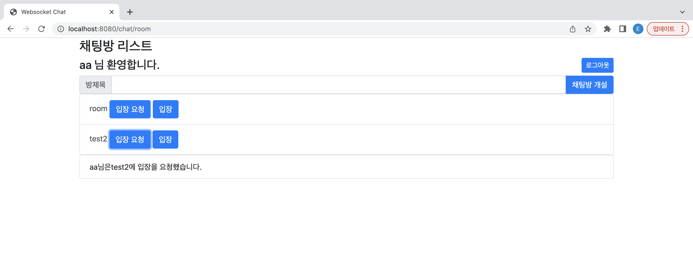

# Chat app 

## Stacks
> Springboot + Java + Mysql

> Vue.js + HTML

## chat and private-message Protocols
> STOMP(Websocket)
- why I use the STOMP?
> make a channel from Server to Client 

> Using HTTP, it is impossible to send from Server to Client

## login, join, create room, enter room Protocols
> Rest API

## flow
> request scenario

> accept scenario (accept)

> accept scenario (deny)

> enter scenario 

## Screen capture
### join

### login

### chatroom list

### request (when accepted)

### request (when denied)

### request simulation
- [request simulation](images/requestvideo.mov)

### accept simulation
- [accept simulation](images/acceptvideo.mov)

### chat

### chat simulation
- [chat simulation](images/chatvideo.mov)

### create room simulation
- [create room simulation](images/createroom.mov)

## Need to improve
1. error handling based on Http status code
2. join column - add creationDate, modifyDate, quitDate field for record
3. package structure for domain (divide chat, account)
- com.websocket.chat.account.controller
- com.websocket.chat.chatroom.controller
5. In mapper, parameter is not delivered @Param, but VO(model)
6. either REST API or STOMP API, API name must be clear(api name is exposed)
